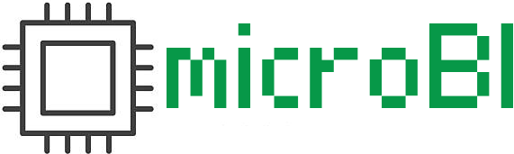

# microbi Von Neumann

Microbi: Microeducatiu basat en l'Arquitectura de Von Neumann

"Microbi" és un nom curt, memorable i suggereix una cosa xicoteta i viva (com un microbi). Et propose una guia completa per a dissenyar-lo.

1. Concepte i filosofia

Microbi hauria de ser:

    ▶️ Minimalista: només els elements essencials de Von Neumann

    ▶️ Didàctic: cada component visible i comprensible

    ▶️ Interactiu: veure el cicle Fetch-Decode-Execute en acció

2. Arquitectura Von Neumann al Microbi

┌─────────────────────────────────────────┐
│              MICROBI                    │
│                                         │
│  ┌──────────┐      ┌──────────────┐     │
│  │   CPU    │◄────►│   MEMÒRIA    │     │
│  │          │ BUS  │ (dades+prog) │     │
│  │ ┌──────┐ │      └──────────────┘     │
│  │ │  PC  │ │                           │
│  │ │  IR  │ │      ┌──────────────┐     │
│  │ │  AC  │ │◄────►│  E/S         │     │
│  │ │  MAR │ │      │ (LEDs, botons│     │
│  │ │  MDR │ │      │  display)    │     │
│  │ └──────┘ │      └──────────────┘     │
│  └──────────┘                           │
└─────────────────────────────────────────┘

3. Especificacions proposades

Component		Especificació
Bus de dades	8 bits
Bus d'adreces	8 bits (256 posicions)
Memòria		256 bytes RAM (programa + dades)
Instruccions	~16 opcodes bàsics
Registres		PC, IR, AC, MAR, MDR, Flag Z
Rellotge		Manual (pas a pas) o automàtic (1-100 Hz)
E/S			8 LEDs, 8 switches, display 7 segments

4. Joc d'instruccions (ISA)

0x0N  LDA #N     Carrega literal N a AC
0x1N  LDA [N]    Carrega de memòria[N] a AC
0x2N  STA [N]    Guarda AC a memòria[N]
0x3N  ADD #N     AC = AC + N
0x4N  ADD [N]    AC = AC + memòria[N]
0x5N  SUB #N     AC = AC - N
0x6N  JMP N      Salta a adreça N
0x7N  JZ  N      Salta si AC = 0
0x8N  OUT N      Escriu AC al port N
0x9N  IN  N      Llegeix port N a AC
0xE0  NOP        No operació
0xF0  HLT        Para

Exemple de programa (sumar 5+3):

00: LDA #5
01: ADD #3
02: OUT 0
03: HLT

5. Interfície d'usuari

Frontal del Microbi:

    🔴 LEDs d'estat: PC, IR, AC, MAR, MDR (visualització binària)

    🟡 8 LEDs de dades del bus

    🟢 Display 7 segments (AC en decimal/hex)

    🔵 Switches: mode (RUN/STEP/HALT), velocitat, reset

    ⚪ Polsador STEP per avançar un cicle

6. Simulador Web del Microbi

Un simulador web és ideal perquè els estudiants puguen escriure, assemblar i executar programes del Microbi. Ací tens el disseny complet i el codi funcional.

6.1. Arquitectura del simulador

┌─────────────────────────────────────────────────┐
│                  SIMULADOR MICROBI              │
├─────────────────────────────────────────────────┤
│  ┌───────────────┐  ┌────────────────────────┐  │
│  │   EDITOR      │  │   VISUALITZACIÓ CPU    │  │
│  │   ASSEMBLER   │  │  PC  IR  AC  MAR  MDR  │  │
│  │               │  │  ▓▓  ▓▓  ▓▓  ▓▓  ▓▓    │  │
│  └───────────────┘  └────────────────────────┘  │
│  ┌───────────────┐  ┌────────────────────────┐  │
│  │   CODI MÀQUINA│  │   MEMÒRIA (256 bytes)  │  │
│  │   00: 05      │  │   ▓▓▓▓░░░░░░░░░░░░     │  │
│  │   01: 13      │  │                        │  │
│  └───────────────┘  └────────────────────────┘  │
│  ┌────────────────────────────────────────────┐ │
│  │  CONTROLS: Step, Run, Pause, Reset         │ │
│  │  Velocitat: ▓▓▓▓░░░░░  [Log d'execució]    │ │
│  └────────────────────────────────────────────┘ │
└─────────────────────────────────────────────────┘

6.2. Estructura de fitxers

microbi/
├── index.html
├── css/
│   └── style.css
├── js/
│   ├── cpu.js          # Nucli de la CPU
│   ├── assembler.js    # Traductor ASM → màquina
│   ├── memory.js       # Gestió de memòria
│   ├── ui.js           # Renderitzat i events
│   └── main.js         # Inicialització
└── examples/
    ├── suma.asm
    ├── comptador.asm
    └── semafor.asm

6.3. Codi complet — index.html

<!DOCTYPE html>
<html lang="ca">
<head>
<meta charset="UTF-8">
<title>Microbi — Simulador Von Neumann</title>
<link rel="stylesheet" href="css/style.css">
</head>
<body>
<header>
  <h1>🧫 Microbi</h1>
  
Simulador del microprocessador educatiu

</header>

<main>
  <!-- EDITOR ASSEMBLER -->
  <section class="panel" id="editor-panel">
    <h2>📝 Editor Assembler</h2>
    <textarea id="asm-input" spellcheck="false">
; Exemple: suma 5 + 3
LDA #5
ADD #3
OUT 0
HLT
    </textarea>
    

      <button id="btn-assemble">⚙️ Assemblar</button>
      <button id="btn-clear">🗑️ Netejar</button>
      <select id="example-select">
        <option value="">— Exemples —</option>
        <option value="suma">Suma 5+3</option>
        <option value="comptador">Comptador 0-9</option>
        <option value="semafor">Semàfor</option>
      </select>
    

  </section>

  <!-- CPU -->
  <section class="panel" id="cpu-panel">
    <h2>🧠 CPU</h2>
    

      
PC<b id="reg-pc">00000000</b>

      
IR<b id="reg-ir">00000000</b>

      
AC<b id="reg-ac">00000000</b>

      
MAR<b id="reg-mar">00000000</b>

      
MDR<b id="reg-mdr">00000000</b>

      
Z<b id="reg-z">0</b>

    

    
Aturat

    
Cicle: —

  </section>

  <!-- MEMÒRIA -->
  <section class="panel" id="memory-panel">
    <h2>💾 Memòria (256 bytes)</h2>
    

  </section>

  <!-- CODI MÀQUINA -->
  <section class="panel" id="code-panel">
    <h2>🔢 Codi Màquina</h2>
    

  </section>

  <!-- E/S -->
  <section class="panel" id="io-panel">
    <h2>🔌 E/S</h2>
    

      Sortides (LEDs):
      

    

    

      Entrades (switches):
      

    

  </section>

  <!-- CONTROLS -->
  <section class="panel" id="controls-panel">
    <h2>🎮 Controls</h2>
    

      <button id="btn-step">⏭️ Step</button>
      <button id="btn-run">▶️ Run</button>
      <button id="btn-pause">⏸️ Pause</button>
      <button id="btn-reset">⟲ Reset</button>
    

    

      <label>Velocitat: <input type="range" id="speed" min="1" max="20" value="5"></label>
      5 Hz
    

  </section>

  <!-- LOG -->
  <section class="panel" id="log-panel">
    <h2>📜 Log d'execució</h2>
    

  </section>
</main>

</body>
</html>

6.4. Nucli de la CPU — js/cpu.js

// ============================================
// MICROBI CPU — Von Neumann
// ============================================

class MicrobiCPU {
  constructor(memory) {
    this.mem = memory;
    this.reset();
  }

  reset() {
    this.PC  = 0;   // Program Counter
    this.IR  = 0;   // Instruction Register
    this.AC  = 0;   // Accumulator
    this.MAR = 0;   // Memory Address Register
    this.MDR = 0;   // Memory Data Register
    this.Z   = 0;   // Zero flag
    this.halted = false;
    this.cycle = 'FETCH';
    this.outputs = new Array(8).fill(0);
  }

  // -------- CICLE D'INSTRUCCIÓ --------
  step() {
    if (this.halted) return { done: true };

    switch (this.cycle) {
      case 'FETCH':   this._fetch();   break;
      case 'DECODE':  this._decode();  break;
      case 'EXECUTE': this._execute(); break;
      case 'WRITEBACK': this._writeback(); break;
    }
    return { done: this.halted };
  }

  _fetch() {
    this.MAR = this.PC;
    this.MDR = this.mem.read(this.MAR);
    this.IR  = this.MDR;
    this.PC  = (this.PC + 1) & 0xFF;
    this.cycle = 'DECODE';
  }

  _decode() {
    this.opcode = (this.IR >> 4) & 0x0F;
    this.operand = this.IR & 0x0F;
    this.cycle = 'EXECUTE';
  }

  _execute() {
    switch (this.opcode) {
      case 0x0: // LDA #N
        this.AC = this.operand;
        break;

      case 0x1: // LDA [N]
        this.MAR = this.operand;
        this.AC  = this.mem.read(this.MAR);
        break;

      case 0x2: // STA [N]
        this.MAR = this.operand;
        this.MDR = this.AC;
        this.mem.write(this.MAR, this.MDR);
        break;

      case 0x3: // ADD #N
        this.AC = (this.AC + this.operand) & 0xFF;
        break;

      case 0x4: // ADD [N]
        this.MAR = this.operand;
        this.AC  = (this.AC + this.mem.read(this.MAR)) & 0xFF;
        break;

      case 0x5: // SUB #N
        this.AC = (this.AC - this.operand) & 0xFF;
        break;

      case 0x6: // JMP N
        this.PC = this.operand;
        break;

      case 0x7: // JZ N
        if (this.AC === 0) this.PC = this.operand;
        break;

      case 0x8: // OUT N
        if (this.operand < 8) {
          this.outputs[this.operand] = this.AC & 0xFF;
        }
        break;

      case 0x9: // IN N  (per ara, llegim 0)
        this.AC = 0;
        break;

      case 0xE: // NOP
        break;

      case 0xF: // HLT
        this.halted = true;
        break;

      default:
        console.warn(`Opcode desconegut: 0x${this.opcode.toString(16)}`);
    }
    this.Z = (this.AC === 0) ? 1 : 0;
    this.cycle = 'WRITEBACK';
  }

  _writeback() {
    this.cycle = 'FETCH';
  }
}

6.5. Memòria — js/memory.js

class MicrobiMemory {
  constructor(size = 256) {
    this.size = size;
    this.data = new Uint8Array(size);
  }

  read(addr) {
    return this.data[addr & 0xFF] || 0;
  }

  write(addr, value) {
    this.data[addr & 0xFF] = value & 0xFF;
  }

  clear() {
    this.data.fill(0);
  }

  load(program, start = 0) {
    for (let i = 0; i < program.length; i++) {
      this.write(start + i, program[i]);
    }
  }
}

6.6. Assembler — js/assembler.js

// ============================================
// ASSEMBLER MICROBI
// Format: OPCODE [operand]
// ============================================

const OPCODES = {
  'LDA':  0x0,  // LDA #N  → literal
  'LDA@': 0x1,  // LDA [N] → memòria
  'STA':  0x2,
  'ADD':  0x3,
  'ADD@': 0x4,
  'SUB':  0x5,
  'JMP':  0x6,
  'JZ':   0x7,
  'OUT':  0x8,
  'IN':   0x9,
  'NOP':  0xE,
  'HLT':  0xF,
};

function assemble(source) {
  const lines = source.split('\n');
  const labels = {};
  const instructions = [];
  const errors = [];
  let addr = 0;

  // ---- PRIMERA PASSADA: recollir etiquetes ----
  for (let i = 0; i < lines.length; i++) {
    let line = lines[i].split(';')[0].trim();  // treure comentaris
    if (!line) continue;

    // Etiqueta: "nom:"
    const labelMatch = line.match(/^([A-Za-z_][A-Za-z0-9_]*):\s*(.*)$/);
    if (labelMatch) {
      labels[labelMatch[1]] = addr;
      line = labelMatch[2].trim();
      if (!line) continue;
    }
    addr++;
  }

  // ---- SEGONA PASSADA: generar codi ----
  addr = 0;
  for (let i = 0; i < lines.length; i++) {
    let raw = lines[i];
    let line = raw.split(';')[0].trim();
    if (!line) continue;

    const labelMatch = line.match(/^([A-Za-z_][A-Za-z0-9_]*):\s*(.*)$/);
    if (labelMatch) line = labelMatch[2].trim();
    if (!line) continue;

    const parts = line.split(/\s+/);
    let mnemonic = parts[0].toUpperCase();
    let operand  = parts[1] || '';

    // Sintaxi: LDA #5  vs  LDA [10]
    if (mnemonic === 'LDA') {
      if (operand.startsWith('#')) { mnemonic = 'LDA'; operand = operand.slice(1); }
      else if (operand.startsWith('[')) { mnemonic = 'LDA@'; operand = operand.slice(1, -1); }
    }
    if (mnemonic === 'ADD') {
      if (operand.startsWith('#')) { mnemonic = 'ADD'; operand = operand.slice(1); }
      else if (operand.startsWith('[')) { mnemonic = 'ADD@'; operand = operand.slice(1, -1); }
    }
    if (mnemonic === 'STA' && operand.startsWith('[')) {
      operand = operand.slice(1, -1);
    }

    if (!(mnemonic in OPCODES)) {
      errors.push(`Línia ${i+1}: mnemònic desconegut "${mnemonic}"`);
      addr++;
      continue;
    }

    // Resoldre operand (número, etiqueta o buit)
    let value = 0;
    if (operand) {
      if (/^\d+$/.test(operand))       value = parseInt(operand, 10);
      else if (/^0x[0-9A-Fa-f]+$/.test(operand)) value = parseInt(operand, 16);
      else if (operand in labels)      value = labels[operand];
      else { errors.push(`Línia ${i+1}: operand desconegut "${operand}"`); }
    }

    if (value > 15) {
      errors.push(`Línia ${i+1}: operand ${value} supera 4 bits (0-15)`);
      value = value & 0x0F;
    }

    const byte = (OPCODES[mnemonic] << 4) | (value & 0x0F);
    instructions.push({ addr, byte, source: raw.trim(), mnemonic, operand: value });
    addr++;
  }

  return { instructions, labels, errors };
}

6.7. Interfície — js/ui.js

// ============================================
// RENDERITZAT DE LA UI
// ============================================

function toBin8(n) { return (n & 0xFF).toString(2).padStart(8, '0'); }
function toHex(n)  { return '0x' + (n & 0xFF).toString(16).toUpperCase().padStart(2, '0'); }

function renderCPU(cpu) {
  document.getElementById('reg-pc').textContent  = toBin8(cpu.PC);
  document.getElementById('reg-ir').textContent  = toBin8(cpu.IR);
  document.getElementById('reg-ac').textContent  = toBin8(cpu.AC);
  document.getElementById('reg-mar').textContent = toBin8(cpu.MAR);
  document.getElementById('reg-mdr').textContent = toBin8(cpu.MDR);
  document.getElementById('reg-z').textContent   = cpu.Z;
  document.getElementById('cpu-cycle').textContent = 'Cicle: ' + cpu.cycle;
  document.getElementById('cpu-state').textContent =
    cpu.halted ? '⏹️ Aturat (HLT)' : '▶️ En marxa';
}

function renderMemory(mem, highlightAddr = -1) {
  const grid = document.getElementById('memory-grid');
  grid.innerHTML = '';
  for (let i = 0; i < 64; i++) {  // mostrem només 64 per claredat
    const cell = document.createElement('div');
    cell.className = 'mem-cell';
    if (i === highlightAddr) cell.classList.add('active');
    if (mem.read(i) !== 0) cell.classList.add('non-zero');
    cell.innerHTML = `${i.toString(16).padStart(2,'0')}
                      ${mem.read(i).toString(16).padStart(2,'0').toUpperCase()}`;
    grid.appendChild(cell);
  }
}

function renderMachineCode(instructions) {
  const el = document.getElementById('machine-code');
  el.innerHTML = instructions.map(i =>
    `

       ${i.addr.toString(16).padStart(2,'0')}:
       ${i.byte.toString(16).padStart(2,'0').toUpperCase()}
       ${i.source}
     
`
  ).join('');
}

function renderLEDs(outputs) {
  const el = document.getElementById('leds');
  el.innerHTML = outputs.map((v, i) =>
    `

       ${v.toString(16).toUpperCase()}
     
`
  ).join('');
}

function log(msg, type = 'info') {
  const el = document.getElementById('log');
  const line = document.createElement('div');
  line.className = 'log-line ' + type;
  line.textContent = `[${new Date().toLocaleTimeString()}] ${msg}`;
  el.prepend(line);
}

6.8. Programa principal — js/main.js

// ============================================
// INICIALITZACIÓ I CONTROLS
// ============================================

const mem = new MicrobiMemory(256);
const cpu = new MicrobiCPU(mem);
let runInterval = null;
let lastInstructions = [];

function refresh() {
  renderCPU(cpu);
  renderMemory(mem, cpu.MAR);
  renderLEDs(cpu.outputs);
}

function doStep() {
  if (cpu.halted) { log('CPU aturada', 'warn'); return; }
  const prevCycle = cpu.cycle;
  cpu.step();
  log(`Cicle ${prevCycle} → PC=${cpu.PC} IR=${toHex(cpu.IR)} AC=${toHex(cpu.AC)}`);
  refresh();

  // Si estem a punt de fer FETCH i ja hem acabat instrucció, log
  if (cpu.cycle === 'FETCH' && cpu.IR !== 0) {
    const instr = lastInstructions.find(i => i.addr === ((cpu.PC - 1) & 0xFF));
    if (instr) log(`  ↳ Executat: ${instr.source}`, 'exec');
  }
}

function doRun() {
  if (runInterval) return;
  const hz = parseInt(document.getElementById('speed').value);
  log(`▶️ Executant a ${hz} Hz`, 'info');
  runInterval = setInterval(() => {
    if (cpu.halted) { doPause(); return; }
    doStep();
  }, Math.max(50, 1000 / hz));
}

function doPause() {
  if (runInterval) { clearInterval(runInterval); runInterval = null; }
  log('⏸️ Pausat', 'info');
}

function doReset() {
  doPause();
  cpu.reset();
  log('⟲ Reiniciat', 'info');
  refresh();
}

function doAssemble() {
  const src = document.getElementById('asm-input').value;
  const result = assemble(src);

  if (result.errors.length) {
    result.errors.forEach(e => log('❌ ' + e, 'error'));
    return;
  }

  mem.clear();
  cpu.reset();
  lastInstructions = result.instructions;
  mem.load(result.instructions.map(i => i.byte));

  renderMachineCode(result.instructions);
  log(`✅ Assemblat: ${result.instructions.length} instruccions`, 'ok');
  refresh();
}

// ---------- EVENTS ----------
document.getElementById('btn-step').onclick  = doStep;
document.getElementById('btn-run').onclick   = doRun;
document.getElementById('btn-pause').onclick = doPause;
document.getElementById('btn-reset').onclick = doReset;
document.getElementById('btn-assemble').onclick = doAssemble;

document.getElementById('btn-clear').onclick = () => {
  document.getElementById('asm-input').value = '';
};

document.getElementById('speed').oninput = (e) => {
  document.getElementById('speed-label').textContent = e.target.value + ' Hz';
  if (runInterval) { doPause(); doRun(); }
};

document.getElementById('example-select').onchange = (e) => {
  const examples = {
    suma: `; Suma 5 + 3\nLDA #5\nADD #3\nOUT 0\nHLT`,
    comptador: `; Comptador 0-9\nLDA #0\nbucle:\nOUT 0\nADD #1\nJMP bucle`,
    semafor: `; Semàfor simple\ninici:\nLDA #1\nOUT 0\nLDA #2\nOUT 0\nJMP inici`
  };
  if (examples[e.target.value]) {
    document.getElementById('asm-input').value = examples[e.target.value];
  }
};

// Inicialització
refresh();
log('🧫 Microbi a punt. Escriu un programa i prem "Assemblar".', 'ok');

6.9. Estil — css/style.css

* { box-sizing: border-box; margin: 0; padding: 0; }

body {
  font-family: 'Courier New', monospace;
  background: #0a0e0a;
  color: #33ff33;
  min-height: 100vh;
  padding: 1rem;
}

header { text-align: center; margin-bottom: 1.5rem; }
h1 { font-size: 2rem; text-shadow: 0 0 10px #33ff33; }
.subtitle { opacity: 0.7; font-size: 0.9rem; }

main {
  display: grid;
  grid-template-columns: 1fr 1fr;
  gap: 1rem;
  max-width: 1400px;
  margin: 0 auto;
}

.panel {
  background: #0f140f;
  border: 1px solid #1a3a1a;
  border-radius: 6px;
  padding: 1rem;
  box-shadow: 0 0 20px rgba(51, 255, 51, 0.05);
}

.panel h2 { font-size: 1rem; margin-bottom: 0.75rem; color: #66ff66; }

/* Editor */
#asm-input {
  width: 100%;
  height: 200px;
  background: #000;
  color: #33ff33;
  border: 1px solid #1a3a1a;
  padding: 0.5rem;
  font-family: inherit;
  font-size: 0.9rem;
  resize: vertical;
}

.btn-row { display: flex; gap: 0.5rem; margin-top: 0.5rem; flex-wrap: wrap; }

button {
  background: #142814;
  color: #33ff33;
  border: 1px solid #33ff33;
  padding: 0.4rem 0.8rem;
  font-family: inherit;
  cursor: pointer;
  border-radius: 4px;
  transition: all 0.2s;
}
button:hover { background: #33ff33; color: #000; }

select, input[type="range"] {
  background: #000; color: #33ff33;
  border: 1px solid #1a3a1a; padding: 0.3rem;
  font-family: inherit;
}

/* Registres */
.registers {
  display: grid;
  grid-template-columns: repeat(3, 1fr);
  gap: 0.5rem;
}
.reg {
  background: #000;
  border: 1px solid #1a3a1a;
  padding: 0.4rem;
  border-radius: 4px;
  text-align: center;
}
.reg span { display: block; font-size: 0.7rem; opacity: 0.6; }
.reg b { font-size: 0.85rem; color: #66ff66; }

.state, .cycle {
  margin-top: 0.75rem;
  padding: 0.5rem;
  background: #000;
  border: 1px solid #1a3a1a;
  border-radius: 4px;
  text-align: center;
  font-size: 0.9rem;
}

/* Memòria */
.memory-grid {
  display: grid;
  grid-template-columns: repeat(8, 1fr);
  gap: 2px;
  font-size: 0.7rem;
}
.mem-cell {
  background: #000;
  border: 1px solid #1a3a1a;
  padding: 2px;
  text-align: center;
  border-radius: 2px;
}
.mem-cell .addr { display: block; opacity: 0.4; font-size: 0.6rem; }
.mem-cell.non-zero { background: #0a1f0a; border-color: #33ff33; }
.mem-cell.active { background: #33ff33; color: #000; }
.mem-cell.active .addr { opacity: 0.8; }

/* Codi màquina */
.machine-code { font-size: 0.8rem; max-height: 200px; overflow-y: auto; }
.mc-line { display: flex; gap: 0.75rem; padding: 2px 0; }
.mc-addr { color: #66ff66; }
.mc-byte { color: #ffff33; }
.mc-src  { opacity: 0.7; }

/* E/S */
.io-row { display: flex; align-items: center; gap: 1rem; margin: 0.5rem 0; }
.leds { display: flex; gap: 0.5rem; }
.led {
  width: 36px; height: 36px;
  border-radius: 50%;
  background: #0a0a0a;
  border: 2px solid #1a3a1a;
  display: flex; align-items: center; justify-content: center;
  font-size: 0.7rem;
  transition: all 0.2s;
}
.led.on {
  background: #33ff33;
  color: #000;
  box-shadow: 0 0 15px #33ff33, 0 0 30px #33ff3388;
}

/* Controls */
.speed-row { display: flex; align-items: center; gap: 1rem; margin-top: 0.75rem; }

/* Log */
#log {
  max-height: 180px;
  overflow-y: auto;
  font-size: 0.75rem;
  line-height: 1.5;
}
.log-line { padding: 1px 0; border-bottom: 1px solid #0f140f; }
.log-line.ok    { color: #33ff33; }
.log-line.warn  { color: #ffff33; }
.log-line.error { color: #ff3333; }
.log-line.exec  { color: #66ccff; }

@media (max-width: 900px) {
  main { grid-template-columns: 1fr; }
}

6.10. Exemples per al Microbi

Ací tens els tres fitxers d'exemple comentats, llestos per a posar a la carpeta examples/.

📄 examples/suma.asm

; ============================================
; suma.asm — Suma bàsica
; ============================================
; Objectiu: sumar dos nombres i mostrar el resultat
; al port de sortida 0.
;
; Resultat esperat: LED 0 s'encén amb valor 8
; ============================================

        LDA #5          ; Carrega el literal 5 a l'acumulador (AC = 5)
        ADD #3          ; Suma 3 a AC                 (AC = 8)
        OUT 0           ; Escriu AC al port 0         (LED = 8)
        HLT             ; Atura la CPU

; --------------------------------------------
; TRAÇA D'EXECUCIÓ:
;   PC=0  FETCH  IR=05  AC=0
;   PC=0  EXEC   IR=05  AC=5
;   PC=1  FETCH  IR=13  AC=5
;   PC=1  EXEC   IR=13  AC=8
;   PC=2  FETCH  IR=80  AC=8
;   PC=2  EXEC   IR=80  AC=8   → LED[0] = 8
;   PC=3  FETCH  IR=F0  AC=8
;   PC=3  EXEC   IR=F0  AC=8   → HALT
; --------------------------------------------

📄 examples/comptador.asm

; ============================================
; comptador.asm — Comptador infinit 0..255
; ============================================
; Objectiu: incrementar AC indefinidament i mostrar-
; lo al port 0. Quan AC desbordi (255 → 0), el
; flag Z s'activarà momentàniament.
;
; Resultat esperat: LED 0 va canviant 0,1,2,3...255,0,...
; ============================================

        LDA #0          ; Inicialitza AC = 0

bucle:
        OUT 0           ; Mostra AC al port 0
        ADD #1          ; AC = AC + 1
        JMP bucle       ; Torna a "bucle" (salt incondicional)

; Mai s'arriba ací (bucle infinit)
        HLT

; --------------------------------------------
; TRAÇA (primers cicles):
;   AC=0   → OUT 0 → LED = 0
;   AC=1   → OUT 0 → LED = 1
;   AC=2   → OUT 0 → LED = 2
;   ...
;   AC=255 → OUT 0 → LED = 255
;   AC=0   → OUT 0 → LED = 0   (desbordament)
;   ...
; --------------------------------------------

📄 examples/semafor.asm

; ============================================
; semafor.asm — Simulació d'un semàfor
; ============================================
; Objectiu: encendre seqüencialment els LEDs 0, 1 i 2
; com si fos un semàfor (verd → groc → vermell).
;
; Resultat esperat:
;   LED 0 (verd)    encès
;   LED 1 (groc)    encès
;   LED 2 (vermell) encès
;   i torna a començar
;
; NOTA: com que no tenim temporitzador, la "duració"
; de cada estat depèn de la velocitat del simulador.
; En maquinari real caldria una pausa (bucle de delay).
; ============================================

inici:
        ; --- ESTAT 1: VERD ---
        LDA #0          ; Apaga tots els LEDs
        OUT 0
        OUT 1
        OUT 2
        LDA #1          ; Encén només LED 0
        OUT 0
        ; (aquí aniria un delay)

        ; --- ESTAT 2: GROC ---
        LDA #0
        OUT 0           ; Apaga verd
        LDA #1
        OUT 1           ; Encén groc
        ; (aquí aniria un delay)

        ; --- ESTAT 3: VERMELL ---
        LDA #0
        OUT 1           ; Apaga groc
        LDA #1
        OUT 2           ; Encén vermell
        ; (aquí aniria un delay)

        JMP inici       ; Torna a començar

        HLT

